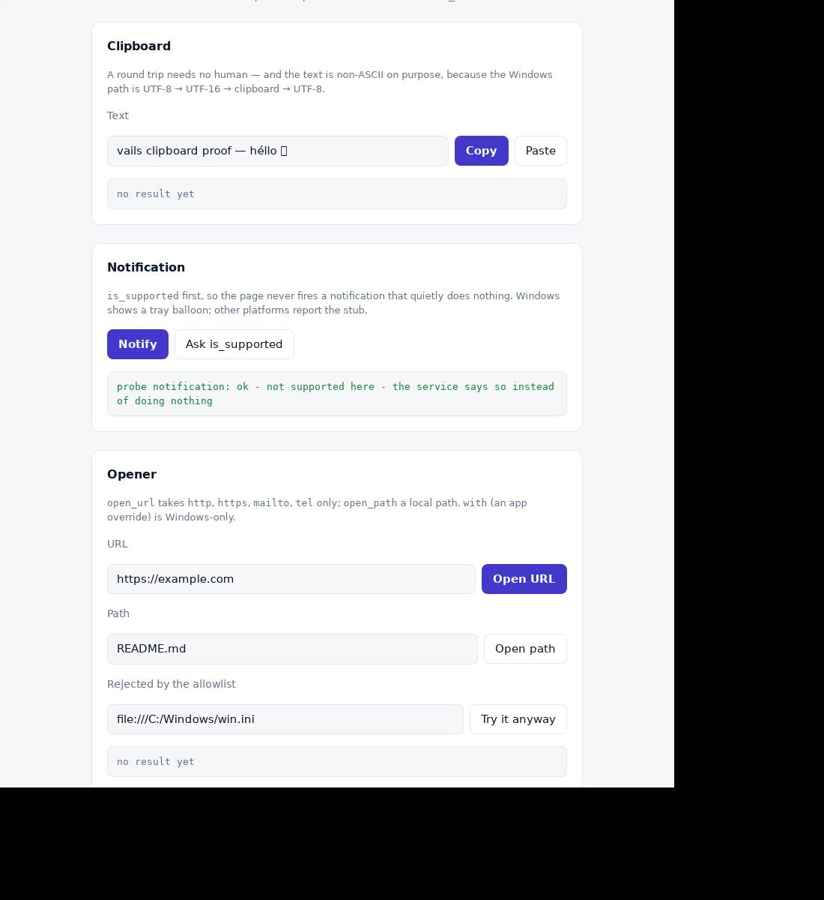

# Linux E2E (xvfb + WebKitGTK)

Unit tests (`v test .`) never open windows, and they are green on Linux too
(29 files, verified 2026-09-27). These checks need a real Linux desktop or
Xvfb and run by hand.

**This machine does have a Linux toolchain** (corrected 2026-09-27, ADR-0015 —
earlier revisions of this file said otherwise, and that is what kept the Linux
backends stubbed). What is there:

```sh
wsl -d Ubuntu -- /root/vsrc/v version      # V 0.5.2, built from source
# the `v` is NOT on PATH: use the absolute path, or export PATH=/root/vsrc:$PATH
wsl -d Ubuntu -- gcc --version             # 15.2
wsl -d Ubuntu -- pkg-config --modversion gtk+-3.0 webkit2gtk-4.1   # 3.24.52 / 2.52.6
wsl -d Ubuntu -- which xvfb-run xwd xwininfo xwdtopnm pnmtojpeg     # the screenshot chain
```

Not installed, and it matters: `xdg-utils` (no `xdg-open` — the opener
service uses GIO instead) and `libnotify` (so notification stays a stub).

## Prereqs (Debian/Ubuntu)

```sh
sudo apt install libgtk-3-dev libwebkit2gtk-4.1-dev xvfb netpbm
```

Headless runs need the usual env (see `run_headless.sh`):
`unset WAYLAND_DISPLAY`, `GDK_BACKEND=x11`,
`WEBKIT_DISABLE_COMPOSITING_MODE=1`, plus `-gc none` on every GUI
build/run (Boehm vs WebKit fork, ADR-0005).

## Phase 1 — window PoC

```sh
v run ./examples/hello
# expect: 1024x768 window titled "Hello Vails", HTML rendered, closes cleanly
```

Record here: exact webkit2gtk version, any signature fixes applied to
`webview/webview_linux.c.v`.

## Phase 2 — bridge (wired 2026-09-27, ADR-0015)

The Linux transport was **declared but never connected** until wave 2:
`run_linux` called neither `run_javascript` nor
`register_script_message_handler`, so no `window.vails` was injected and
every example rendered in preview mode. It is wired now: the runtime goes in
as a user script, `script-message-received` is connected, and the reply
rides back out through `bridge.resolve_json` + `run_javascript` (the raw
WebKitGTK path of ADR-0004 — Linux has no return value to resolve a promise
with).

Pure-V coverage (runs on any OS via `v test .`):

- `bridge.Router.handle_message` — JSON in, JSON out (incl. malformed input)
- `bridge.runtime_js` — injected `window.vails` runtime markers
- `bridge.resolve_js` / `resolve_json` / `events.to_js` — evaluate snippets,
  escaping via `jsesc`

Manual Linux steps:

```sh
v run ./examples/hello
# 1. the page must NOT say "preview mode" - that means the runtime is missing
# 2. click "ping backend" -> status becomes "backend says: pong"
#    (JS: window.vails.call('ping') -> postMessage -> message_cb ->
#     Router.handle_envelope_from -> run_javascript(__resolve(...)))
```

If step 2 hangs (the promise never settles), the message reached V but the
reply did not come back; `eprintln` the body in `message_cb` and check
`vails_run_javascript`. If the page is in preview mode instead, the user
script did not run — check `vails_add_runtime`.

## T3 channels / T4 state / T7 CSP (pure-V, verified via `v test .`)

- Channels (`bridge.ChannelHub`, ADR-0011): no native changes — the V
  side evaluates `push_js`/`close_js` snippets via run_javascript and
  the frontend subscribes with the existing
  `window.vails.onEvent('ch_<n>', cb)`. Manual check: open a channel in
  a handler, evaluate two pushes + close, confirm ordered delivery and
  the `<id>:close` marker.
- State (`state.Store`, ADR-0011): same-thread handler access only;
  `spawn` workers must deliver results as events (ADR-0010 rule).
- CSP (T7, ADR-0012): hello ships `webview.default_csp()` verbatim;
  confirm DevTools shows no CSP violations on load and the preview
  fallback (file:// open of `frontend/index.html`) renders with the
  counter running locally.

## Phase 3/4 — dev server + CLI (ADR-0013; CLI E2E-verified on Windows)

```sh
v -o vails ./cli && ./vails init smokeapp && cd smokeapp
./vails doctor   # expect: vails home ok, vails.json ok, asset_root ok
./vails run --serve-only --port 8421 &
curl -s http://127.0.0.1:8421/ | grep __vails_dev_version
# expect: the livereload poller script, injected before </body>
curl -s http://127.0.0.1:8421/__vails_dev_version
# expect: build_id:tree-fingerprint (moves on every frontend save)
curl -s -o /dev/null -w '%{http_code}' http://127.0.0.1:8421/nope
# expect: 404
export VAILS_HOME=<vails checkout>   # only outside a checkout
./vails build    # expect: ./smokeapp binary
./vails run      # expect: window at the dev URL; ping fails with
# 'unknown method' (empty router — frontend iteration only, ADR-0013)
```

`./cli` builds on Linux since ADR-0015 (it did not before: the same two gcc
errors the app build had).

## Phase 5 S1 wave 2 — services on Linux (ADR-0015, verified 2026-09-27)

```sh
cd /mnt/d/MyProjects/vails
VAILS_SERVICES_PROBE=clipboard sh tests/e2e_linux/run_services.sh
```

`run_services.sh` builds `examples/services` with `-gc none`, runs it under
xvfb with the probe, and screenshots the root window into
`tests/e2e_linux/services.png`.

- **`clipboard` — real GTK backend, E2E-proven.** The page writes
  `vails clipboard proof — héllo 🌱` and reads it back; the status line shows
  `round trip ok, read back: "…"`, i.e. the whole JS → V → GTK clipboard → V →
  JS path. No human involved, which is why this is a screenshot and not a
  checklist item. (The 🌱 renders as a box: the container has no emoji font.
  The round trip itself is exact.)

  

- **`notification` — honest stub.** `is_supported` answers `false` and the
  page says so instead of firing into nothing:

  

- **`opener` — real GIO backend.** `open_url` needs a desktop session to
  have a handler; in this container it answers with the GError GIO returned
  (`could not open …: Failed to open …`), which is the honest answer and
  proves the error path. On a real desktop it launches the browser.
  `open_path` canonicalizes the path first (`g_canonicalize_filename` +
  `g_filename_to_uri`), and `with` is refused with a readable error because
  the desktop resolves applications itself.

Still stubs (Phase 5b):

- `services/dialog_linux.c.v` — `GtkFileChooserDialog` parented to
  `Ctx.parent` (the GdkWindow), run from the GTK main loop. `gtk_dialog_run()`
  spins a nested loop, which is exactly why modal services are allowed to
  block (ADR-0014). Never `gtk_main_quit` from a response handler. Keep UTF-8
  end to end (`g_filename_to_utf8` / `g_filename_from_utf8`), map the response
  to the same `Result` shape (`canceled` / `paths`), and map a GTK failure to
  an error, never to a silent empty result. It is the last S1 item waiting on
  a human answering a modal window.
- `notification` on Linux — libnotify or `GNotification`. Either needs a
  D-Bus session bus to be visible at all, and this container has
  `dbus-run-session` but no notification daemon; a "success" that nothing
  displays is worse than the stub.

Manual checklist for whoever has a Linux desktop:

```sh
v -gc none -o dialog ./examples/dialog
./dialog
# 1. "Open file…" -> GtkFileChooserDialog, parented to the GTK window,
#    the params' title + filters applied, UTF-8 paths in the result
# 2. cancel -> the promise resolves with {canceled: true} (not a rejection)
# 3. "Save as…" -> default name in the name field
# 4. "Ask…"/"Confirm…" -> GtkMessageDialog with ok / yes-no-cancel
# 5. "Read host info" -> os_info.get resolves (no native code involved)
# 6. "Call an ungranted command" -> 'forbidden: …'
```

Same rule for the rest of the catalog: pure-V seam + tests first, native side
second (AGENTS.md §4) — and now "second" means "compiled and run", because the
toolchain is here.
