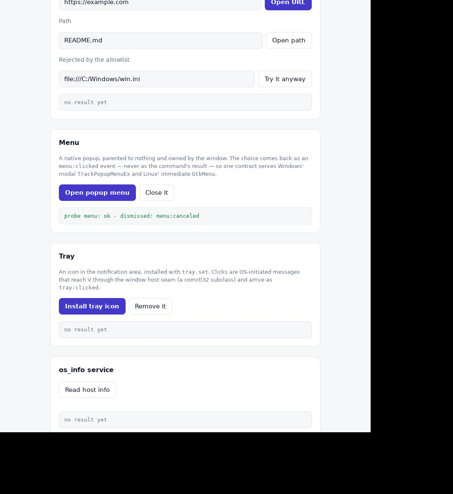
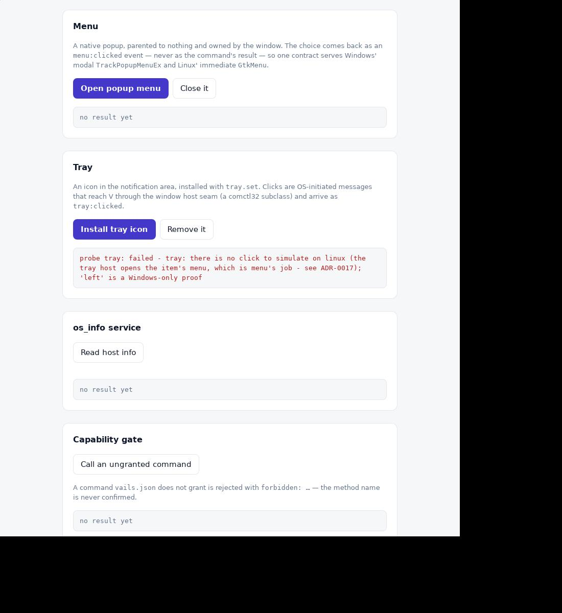
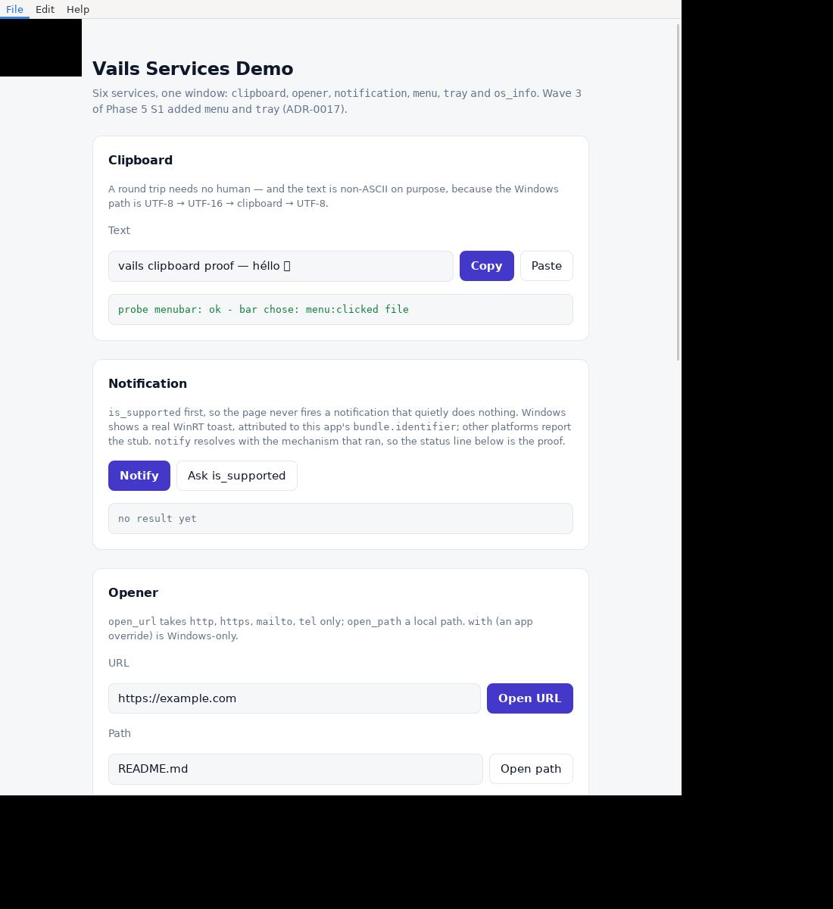
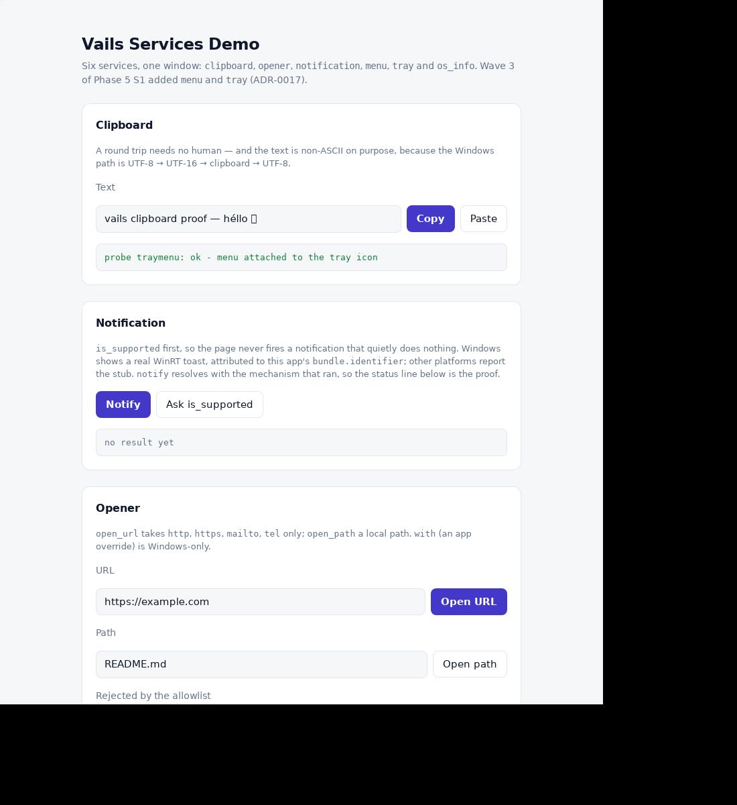

# Linux E2E (xvfb + WebKitGTK)

Unit tests (`v test .`) never open windows, and they are green on Linux too
(29 files, verified 2026-09-27). These checks need a real Linux desktop or
Xvfb and run by hand.

**This machine does have a Linux toolchain** (corrected 2026-09-27, ADR-0015 —
earlier revisions of this file said otherwise, and that is what kept the Linux
backends stubbed). What is there:

```sh
wsl -d Ubuntu -- /root/vsrc/v version      # V 0.5.2, built from source
# the `v` is NOT on PATH: use the absolute path, or export PATH=/root/vsrc:$PATH
wsl -d Ubuntu -- gcc --version             # 15.2
wsl -d Ubuntu -- pkg-config --modversion gtk+-3.0 webkit2gtk-4.1   # 3.24.52 / 2.52.6
wsl -d Ubuntu -- which xvfb-run xwd xwininfo xwdtopnm pnmtojpeg     # the screenshot chain
```

Not installed, and it matters: `xdg-utils` (no `xdg-open` — the opener
service uses GIO instead) and `libnotify` (so notification stays a stub).
**Installed for wave 3:** `libayatana-appindicator3-dev` (the `tray` service;
`vails doctor` reports it as `appindicator`).

## Verification status — read this before trusting a green run

| Wave | `v test` | App builds | Screenshots |
|---|---|---|---|
| Phases 0–4, T1–T7 | ✅ 29 files (2026-09-27) | ✅ | ✅ `hello`, `dialog` |
| S1 wave 2 (clipboard/opener/notification) | ✅ 2026-09-27 | ✅ | ✅ `services.png`, `notification.png` |
| S1 wave 3 (`menu`, `tray`, ADR-0017) | ✅ 32 files (2026-09-28) | ✅ | ✅ `menu.png`, `tray.png` |
| ADR-0018 (WinRT toast) | n/a (Windows-only) | ✅ (the same fix unblocked it) | ⛔ pending (needs a machine with the WinRT runtime) |
| S1 wave 4 (`menu.set_menu`, ADR-0023) | ✅ 32 files (2026-09-29) | ✅ | ✅ `menubar.png` |

### The wave-3 Linux build failure — root cause, corrected 2026-09-28

An earlier revision of this file blamed "a V 0.5.2 C-codegen problem" and
claimed V "did not emit the hand-written `fn C.*` prototypes". **That diagnosis
was wrong**, and it sent the fix in the wrong direction. There were four
separate faults, none of them a V bug:

1. **Missing `@[c_extern]` (V's actual contract).** V 0.5.2 emits a C prototype
   for `fn C.f` only when the header declaring `f` is `#include`d **or** the
   declaration carries `@[c_extern]`. With neither, V emits nothing and gcc
   reports `implicit declaration of function`. `tray_linux.c.v` declares the
   AppIndicator API by hand precisely because the header is *not* included
   (it drags in the dbusmenu chain), so every one of its five functions needed
   the attribute and had none. Reproduced in a 20-line file and fixed with one
   attribute. V even says so itself when it happens: *"mark the V declaration
   with `@[c_extern]`"*.
2. **Two symbols that do not exist in GTK3 at all.** `gtk_menu_item_set_sensitive`
   and `g_object_set_int`/`g_object_get_int` are in no header *and* in no symbol
   table (`nm -D` on `libgtk-3.so.0` / `libgobject-2.0.so.0` → 0 hits). GTK3
   folded sensitivity into `gtk_widget_set_sensitive`, and the GObject typed
   accessors were macros, which can be neither declared nor linked. Replaced
   with `gtk_widget_set_sensitive` and `g_object_set_data`/`get_data`.
3. **`item-activated` is not a GTK3 signal.** ADR-0017 designed the Linux menu
   around one `item-activated` connection on the `GtkMenu`. `item-activated` is
   a GTK2 leftover: `g_signal_list_ids` on `GtkMenu` in 3.24 returns **zero**
   signals, and connecting to it logged `signal 'item-activated' is invalid for
   instance ... of type 'GtkMenu'` at runtime. `activate` is a `GtkMenuItem`
   signal, so it is now connected per item, in `build_menu`, where the item
   widget exists.
4. **`gtk_menu_popup_at_pointer(menu, NULL)` never showed anything.** ADR-0017
   called a NULL event "the whole Linux answer". It is not: with no event GTK
   has no trigger window, logs `no trigger event for menu popup` plus
   `gtk_menu_popup_at_rect: assertion 'GDK_IS_WINDOW (rect_window)' failed`, and
   leaves the menu created but unmapped, so the frontend waits forever. Now
   `gtk_menu_popup_at_rect` against `Ctx.parent` (already the GdkWindow) at the
   pointer position, which is the placement Windows gets from `GetCursorPos`.

Plus a fifth, found only once the build was green:
**`gtk_menu_popdown` does not emit `deactivate`.** ADR-0017 assumed it did and
left the teardown to that signal, so `menu.close` emitted nothing, left
`st.open` true and leaked the context. Verified directly (`deactivated == 0`).
The teardown is now a shared function that both the `deactivate` handler and
`menu.close` call, guarded so it runs once.

The lesson worth keeping: every one of these was invisible while the file did
not compile, and three of the four were only visible by *running* the thing.
A green build is not a verified backend.

### Windows-side flakiness, for the record

`v test .` on Windows is not reliably green on this machine, for reasons that
have nothing to do with the service backends:

- `dev/dev_test.v` fails to **link**: `undefined reference to __imp_inet_pton`
  and friends. It needs `-lws2_32`, which `dev.v` does not declare for its
  `import net.http`. Pre-existing.
- Under parallel jobs, a *different random* test file per run fails with
  `src.c:NNNN: error: invalid initializer` on a line of the shape
  `string __return_array_value_N = *(void*)(array_get(res, ...))` — a V codegen
  bug in array-returning helpers. Every affected file passes when run on its
  own. Observed failing across runs: `assets_test`, `clipboard_test`,
  `install_test`, `support_test`, `host_test` (never a stable set).

**Bisect with copies, not `git checkout`.** The wave-3 files were uncommitted
while this was investigated, so `git checkout` on one silently reverted it to a
pre-wave-3 version. That produced a fake "baseline" twice.

### WSL access (changed 2026-09-28)

The distro's default user is now `xman`, and the V toolchain is still under
`/root` (`drwx------`), so `wsl -d Ubuntu -- /root/vsrc/v` fails with
`Permission denied` and there is no passwordless sudo. Either grant access or
target root explicitly:

```sh
wsl -d Ubuntu -u root -- /root/vsrc/v version
```

The VM still dies with `Catastrophic failure / E_UNEXPECTED` under memory
pressure during long compile runs; `wsl --shutdown` recovers it. `/tmp` does
not always survive across runs, so keep scratch output elsewhere if a run
matters. `xdotool` is installed (added 2026-09-28) for the menu probe below.


## Prereqs (Debian/Ubuntu)

```sh
sudo apt install libgtk-3-dev libwebkit2gtk-4.1-dev libayatana-appindicator3-dev xvfb netpbm
```

Headless runs need the usual env (see `run_headless.sh`):
`unset WAYLAND_DISPLAY`, `GDK_BACKEND=x11`,
`WEBKIT_DISABLE_COMPOSITING_MODE=1`, plus `-gc none` on every GUI
build/run (Boehm vs WebKit fork, ADR-0005). The `tray` probe also wants
`dbus-run-session -- <app>`: the StatusNotifierItem registers on the D-Bus
*session* bus, and without one GLib cannot autolaunch and the item is created
but never appears.

## Phase 1 — window PoC

```sh
v run ./examples/hello
# expect: 1024x768 window titled "Hello Vails", HTML rendered, closes cleanly
```

Record here: exact webkit2gtk version, any signature fixes applied to
`webview/webview_linux.c.v`.

## Phase 2 — bridge (wired 2026-09-27, ADR-0015)

The Linux transport was **declared but never connected** until wave 2:
`run_linux` called neither `run_javascript` nor
`register_script_message_handler`, so no `window.vails` was injected and
every example rendered in preview mode. It is wired now: the runtime goes in
as a user script, `script-message-received` is connected, and the reply
rides back out through `bridge.resolve_json` + `run_javascript` (the raw
WebKitGTK path of ADR-0004 — Linux has no return value to resolve a promise
with).

Pure-V coverage (runs on any OS via `v test .`):

- `bridge.Router.handle_message` — JSON in, JSON out (incl. malformed input)
- `bridge.runtime_js` — injected `window.vails` runtime markers
- `bridge.resolve_js` / `resolve_json` / `events.to_js` — evaluate snippets,
  escaping via `jsesc`

Manual Linux steps:

```sh
v run ./examples/hello
# 1. the page must NOT say "preview mode" - that means the runtime is missing
# 2. click "ping backend" -> status becomes "backend says: pong"
#    (JS: window.vails.call('ping') -> postMessage -> message_cb ->
#     Router.handle_envelope_from -> run_javascript(__resolve(...)))
```

If step 2 hangs (the promise never settles), the message reached V but the
reply did not come back; `eprintln` the body in `message_cb` and check
`vails_run_javascript`. If the page is in preview mode instead, the user
script did not run — check `vails_add_runtime`.

## T3 channels / T4 state / T7 CSP (pure-V, verified via `v test .`)

- Channels (`bridge.ChannelHub`, ADR-0011): no native changes — the V
  side evaluates `push_js`/`close_js` snippets via run_javascript and
  the frontend subscribes with the existing
  `window.vails.onEvent('ch_<n>', cb)`. Manual check: open a channel in
  a handler, evaluate two pushes + close, confirm ordered delivery and
  the `<id>:close` marker.
- State (`state.Store`, ADR-0011): same-thread handler access only;
  `spawn` workers must deliver results as events (ADR-0010 rule).
- CSP (T7, ADR-0012): hello ships `webview.default_csp()` verbatim;
  confirm DevTools shows no CSP violations on load and the preview
  fallback (file:// open of `frontend/index.html`) renders with the
  counter running locally.

## Phase 3/4 — dev server + CLI (ADR-0013; CLI E2E-verified on Windows)

```sh
v -o vails ./cli && ./vails init smokeapp && cd smokeapp
./vails doctor   # expect: vails home ok, vails.json ok, asset_root ok
./vails run --serve-only --port 8421 &
curl -s http://127.0.0.1:8421/ | grep __vails_dev_version
# expect: the livereload poller script, injected before </body>
curl -s http://127.0.0.1:8421/__vails_dev_version
# expect: build_id:tree-fingerprint (moves on every frontend save)
curl -s -o /dev/null -w '%{http_code}' http://127.0.0.1:8421/nope
# expect: 404
export VAILS_HOME=<vails checkout>   # only outside a checkout
./vails build    # expect: ./smokeapp binary
./vails run      # expect: window at the dev URL; ping fails with
# 'unknown method' (empty router — frontend iteration only, ADR-0013)
```

`./cli` builds on Linux since ADR-0015 (it did not before: the same two gcc
errors the app build had).

## Phase 5 S1 wave 2 — services on Linux (ADR-0015, verified 2026-09-27)

```sh
cd /mnt/d/MyProjects/vails
VAILS_SERVICES_PROBE=clipboard sh tests/e2e_linux/run_services.sh
```

`run_services.sh` builds `examples/services` with `-gc none`, runs it under
xvfb with the probe, and screenshots the result into a file **named after the
probe** (`clipboard` → `services.png`, everything else → `<probe>.png`).

That per-probe naming is not cosmetic. It used to be one `services.png` for
every probe, so each run overwrote the last: `services.png` and
`notification.png` were byte-identical, and the clipboard round trip cited below
as proven had in fact been destroyed by a later `notification` run. Re-taken
2026-09-28.

- **`clipboard` — real GTK backend, E2E-proven.** The page writes
  `vails clipboard proof — héllo 🌱` and reads it back; the status line shows
  `round trip ok, read back: "…"`, i.e. the whole JS → V → GTK clipboard → V →
  JS path. No human involved, which is why this is a screenshot and not a
  checklist item. (The 🌱 renders as a box: the container has no emoji font.
  The round trip itself is exact.)

  

- **`notification` — honest stub.** `is_supported` answers `false` and the
  page says so instead of firing into nothing:

  

- **`opener` — real GIO backend.** `open_url` needs a desktop session to
  have a handler; in this container it answers with the GError GIO returned
  (`could not open …: Failed to open …`), which is the honest answer and
  proves the error path. On a real desktop it launches the browser.
  `open_path` canonicalizes the path first (`g_canonicalize_filename` +
  `g_filename_to_uri`), and `with` is refused with a readable error because
  the desktop resolves applications itself.

Still stubs (Phase 5b):

- `notification` on Linux — libnotify or `GNotification`. Either needs a
  D-Bus session bus to be visible at all, and this container has
  `dbus-run-session` but no notification daemon; a "success" that nothing
  displays is worse than the stub.

Manual checklist for whoever has a Linux desktop:

```sh
v -gc none -o dialog ./examples/dialog
./dialog
# 1. "Open file…" -> GtkFileChooserDialog, parented to the GTK window,
#    the params' title + filters applied, UTF-8 paths in the result
# 2. cancel -> the promise resolves with {canceled: true} (not a rejection)
# 3. "Save as…" -> default name in the name field
# 4. "Ask…"/"Confirm…" -> GtkMessageDialog with ok / yes-no-cancel
# 5. "Read host info" -> os_info.get resolves (no native code involved)
# 6. "Call an ungranted command" -> 'forbidden: …'
```

Same rule for the rest of the catalog: pure-V seam + tests first, native side
second (AGENTS.md §4) — and now "second" means "compiled and run", because the
toolchain is here.

### The two things a headless run cannot check

Both are one click on a real desktop, and both are listed so nobody
rediscovers them as a bug:

```sh
v -gc none -o services ./examples/services
./services
# 1. Menu -> "Open popup menu", then CLICK AN ITEM.
#    expect: "chose: <id>" and the matching menu:clicked id. Under Xvfb the
#    popup appears and menu:canceled is proven, but no click can land on it:
#    with no window manager the override-redirect menu takes the first click as
#    a focus click. This is the only unproven part of the Linux menu backend.
# 2. Tray -> "Install tray icon", then look at the panel.
#    expect: the icon is drawn (needs a StatusNotifierHost - GNOME's extension,
#    KDE's plasma). Press it: expect the indicator's own menu, NOT tray:clicked.
#    That is the platform difference, and tray.set_menu is what gives it items.
```

## Phase 5 S1 wave 3 — `menu` + `tray` on Linux (ADR-0017, verified 2026-09-28)

Run it with:

```sh
cd /mnt/d/MyProjects/vails
VAILS_SERVICES_PROBE=menu  sh tests/e2e_linux/run_services.sh   # popup
VAILS_SERVICES_PROBE=tray  sh tests/e2e_linux/run_services.sh   # item
```

The tray probe wants a session bus, so wrap that one:
`dbus-run-session -- ./vails_services`.

- **`menu` — the popup and the event round trip are proven.**
  `gtk_menu_popup_at_rect` against the window's own GdkWindow at the pointer
  position. One `activate` connection per item (GTK3 has no `item-activated` —
  see the root-cause section above), with the item's 1-based index stamped on
  the widget under a GObject data key so the id list and the widget cannot
  disagree. The evidence is threefold, and all three are machine-checkable:

  1. **The menu maps.** `xwininfo -root -tree` shows a real override-redirect
     window, `135x110+550+0`, for the two-item/one-separator fixture. That
     geometry is the proof — with the old `at_pointer` call there was no such
     window at all, only a GTK-CRITICAL in the log.
  2. **`menu:canceled` reaches the frontend.** The hold timer calls
     `menu.close`, the shared teardown runs, and the page shows
     `probe menu: ok · dismissed: menu:canceled`.
  3. **The context is not leaked.** The teardown is guarded, so a
     `menu.close` racing a user dismissal frees the context once, not twice.

  

  **Still a manual item: the `menu:clicked {id}` mapping.** It needs a pointer
  click *inside* the open menu, and under Xvfb there is no window manager, so
  the override-redirect menu takes the first click as a focus click and
  `xdotool` cannot land an activation — pressing and releasing inside the item
  dismisses the menu without activating. Keyboard activation does not reach it
  either (nothing holds X input focus without a WM). The id table itself is
  covered by `menu_test.v`'s `flatten_items` assertions; what is unproven is
  only GTK delivering a click to the right item. A real desktop session settles
  it in one click.

- **`tray` — only the registration is provable here, and the page now says so.**
  `app_indicator_new` + `APP_INDICATOR_STATUS_ACTIVE` (a new indicator is born
  PASSIVE, which is the usual "my tray icon does not show up") +
  `app_indicator_set_label` for the tooltip, and `g_object_unref` in
  `tray.destroy` because the last reference is what removes it from the panel.
  The proof that `tray.set` *worked* is that `simulate_click` gets far enough
  to refuse for its own reason ("no click to simulate on linux") instead of
  complaining that nothing is installed. Two things make the icon itself
  invisible here and neither is a code bug: a **StatusNotifierHost** does not
  exist under Xvfb, and without `dbus-run-session` there is no session bus.

  The probe's outcome is delivered to the page as `probe:done`, not just
  `eprintln`ed, so the screenshot carries the reason. That was a gap: the
  function's own comment asked for "not an empty status line in a screenshot"
  while a log line cannot be one.

  

- **There is no `tray:clicked` on Linux**, and `simulate_click` refuses with
  that reason: this version of libayatana-appindicator has no `activate`
  signal, because the SNI *host* owns the click and opens the menu the app
  attached to the item. `tray.set_menu` (wiring the `menu` service's items to
  the indicator) landed 2026-09-29 as ADR-0026. See ADR-0017/0026.

The GTK signal → V path this service relies on is not unproven on Linux: the
bridge's `script-message-received` (ADR-0015) and the menu item's `activate`
(ADR-0017) are both GObject signals reaching a V handler.


## Phase 5 S1 wave 4 — `menu.set_menu`, the window menu bar (ADR-0023, verified 2026-09-29)

```sh
cd /mnt/d/MyProjects/vails
VAILS_SERVICES_PROBE=menubar sh tests/e2e_linux/run_services.sh
```

`run_services.sh` clicks the bar for this probe, because a menu bar is not
modal: nothing is "up" waiting to be dismissed, so the only way to photograph
the proof is to pick an item and let the page report the `menu:clicked` it
received.



- **Fully proven, and provable further than the popup.** The screenshot shows
  the bar rendered across the top of the window (`File  Edit  Help`) *and* the
  page reporting `bar chose: menu:clicked file` after a click on `File`. So
  the whole chain is machine-checked: `menu.set_menu` -> `GtkMenuBar` packed at
  row 0 -> the item's `activate` -> the id stamped on the widget at build time
  -> `menu:clicked` -> the page.

  This is the one gap in the wave-3 list that the headless box *closed* rather
  than left open. The popup's `menu:clicked` id mapping is still a manual item
  (an override-redirect window takes the first click as a focus click with no
  window manager); the bar is an ordinary widget inside the window, so the
  click lands. Same event, same classifier, and the harder case is the one that
  automates.

- **Three GTK3 facts, each verified before being written down** — the same
  discipline that caught the wave-3 faults, and the same shape of mistake:
  `gtk_window_set_menubar` **does not exist in 3.24** (a GTK2 function; only
  the unrelated `gtk_application_set_menubar` survives); a `GtkWindow` is
  **not** a `GtkBox`, so the bar cannot be packed into the window; and the
  webview used to be the window's only child, so there was nowhere for a bar to
  go. `run_linux` now always puts the webview in a vertical box, which is
  visually identical with no bar and is what makes one possible. The bar is
  `show_all`-ed *before* packing, because a widget packed while unrealized has
  no size request and comes out 1px tall.

- **The one `-w` lesson.** V's default C flags include `-w`, which had been
  hiding a real type error for the whole of wave 3: declaring
  `g_signal_connect_data`'s callback as `voidptr` is not glib's `GCallback`, and
  gcc 15 makes that an error. It only appeared when the fallback compiler ran
  without `-w`. `menu_linux.c.v` now declares the type honestly. A warning
  suppressed by `-w` is not a warning that has been dealt with.


## Phase 5 S1 wave 4 — `tray.set_menu`, the tray icon's menu (ADR-0026, verified 2026-09-29)

```sh
cd /mnt/d/MyProjects/vails
VAILS_SERVICES_PROBE=traymenu sh tests/e2e_linux/run_services.sh
```



- **Partly proven, and the limit is the platform's, not the harness's.** The
  page reports `menu attached to the tray icon`, which proves the command
  resolved, the items were validated, and `app_indicator_set_menu` accepted the
  menu. It does **not** prove the menu opens, and there is no screenshot that
  could: the menu is opened by the StatusNotifierItem *host* (GNOME Shell, KDE),
  and a headless Xvfb run has no host at all. The same is true of the right
  click, which is why there is nothing to simulate here either — the
  `tray:clicked` note in the wave-3 section above applies to this probe too.

  The remaining proof is the one-command manual check: attach a menu, right click
  the icon in a real panel, and confirm the item arrives as `menu:clicked`.

- **The contract change is the risky part, not the code.** With a menu attached
  a right click emits no `tray:clicked` at all. An app that never calls
  `tray.set_menu` is unaffected; an app that does and still listens for the
  right-click event will notice. ADR-0026 decision 2 states the rule and the
  alternative that was rejected.

- **A real bug this surfaced, which the Linux screenshot would not have.** The
  handler branched on a `bool` that meant both "the menu owns this" and "not the
  tray's message", so any foreign message opened the tray menu and was consumed
  — which ate the window menu bar's `WM_COMMAND` on the same window. Both live in
  the `examples/services` window, so the two features collide in exactly the run
  that exercises them. The fix (`decide`, three outcomes) and its regression test
  are in ADR-0026 decision 3; the lesson recorded there is that every predicate
  test passed while the composition was wrong, because nothing tested the
  composition.


## Phase 5b — the GTK `dialog` (ADR-0027, verified 2026-09-29)

```sh
cd /mnt/d/MyProjects/vails
VAILS_SERVICES_PROBE=dialog sh tests/e2e_linux/run_services.sh
```

> **There is no committed screenshot for this run, and the image link that used
> to sit here pointed at nothing.** `tests/e2e_linux/dialog.png` has never existed
> in this repository — `git log --all -- tests/e2e_linux/dialog.png` returns no
> commits at all — yet this section and ADR-0027 both cited it as the proof. So
> the claim below rests on the probe's stdout, not on an image, and it is now
> worded as what it is. Re-capturing it is a small job on any machine with the
> GTK stack; until someone does, there is nothing in the repo to check by looking.

- **Fully proven, and provable without a human — by the probe's report, not by a
  committed screenshot.** The run reported a real `GtkMessageDialog` answered by
  a timer from a `g_timeout_add`, reporting `button: ok, canceled: false`. So
  the whole chain is machine-checked: `dialog.message` -> `gtk_message_dialog_new`
  -> `gtk_dialog_run`'s nested main loop -> `GTK_RESPONSE_OK` -> the shared
  response mapping -> the page.

  The "last S1 item waiting on a human answering a modal window" was not one.
  A `g_timeout_add` callback scheduled *before* the page's call runs inside the
  nested loop `gtk_dialog_run` spins, which is the only mechanism that can reach
  a modal dialog that is already blocking.

- **The proof deliberately lives in the example, not in `services/`.**
  `examples/services/autoanswer_shim.h` finds the open dialog through
  `gtk_window_list_toplevels` and answers whichever modal toplevel it finds. The
  service therefore needs no test hook, no probe flag and no cooperation of any
  kind — the only arrangement under which the proof means anything. A variant
  that handed the dialog pointer to the service would have proved that a
  function called with a pointer works.

- **The native path has no unit test, on purpose.** It cannot have one: with no
  display the call returns an error, and with a display it opens a real modal
  dialog and parks in `gtk_dialog_run` forever. The stub-era test only passed
  because there was no backend behind it. So the coverage is split — the
  response-id mapping is pure V in `services/dialog.v` and tested on *both*
  platforms, and the widget is proven here. `services/dialog_test.v` asserts the
  part that is reachable headlessly: that bad input is rejected *before* a widget
  is built.

- **Two GTK facts that cost a compile each**, both recorded in ADR-0027:
  `g_filename_to_utf8` is a five-argument macro, so the two-argument declaration
  V wants is rejected by a static assert in the GLib header; and
  `gtk_window_is_modal` does not exist in GTK 3 (it is `gtk_window_get_modal`).
  The stub's own comment had also said to parent the chooser to `Ctx.parent`,
  which is a `GdkWindow` — the parameter wants a `GtkWindow`, so that was a type
  error waiting to be written. It is `Ctx.toplevel`, as ADR-0023 already
  established.

- **A headless app gets an error, not a crash.** `gtk_init_check` runs before any
  other GTK call, and all three commands refuse with `no display available`.
  This was not speculative: the moment the backend became real, the test suite
  died exactly this way.

## U0/W0 — `webview.post_to_main` (ADR-0019) — **Windows-only; the Linux half is unwritten**

The main-thread post seam shipped on **Windows only** (2026-09-30, proven with
a screenshot — see `tests/e2e_windows/README.md`). There is deliberately **no
Linux half yet**, so on this platform:

```sh
cd /mnt/d/MyProjects/vails
# `v test .` passes: webview/jobs.v compiles, and its queue is pure V.
# `VAILS_SERVICES_PROBE=post` will NOT work here — the V half reports:
#   vails: post_to_main is not available on linux yet
#          (the g_idle_add half is unwritten - ADR-0019)
```

- **What is already in place, and is platform-neutral:** `JobQueue` (a real
  `sync.Mutex` over `[]Job`), `MainThread`, `Job = fn ()`, the
  `wakeup_message` id, and `Ctx.main`. `webview.run` creates and destroys a
  `MainThread` on Linux too, so the backend call site is not inside a `$if` and
  the shape stays symmetric with Windows.

- **What is missing is exactly one function, and it is the risky one.** The
  Windows wakeup is a `SetWindowSubclass` on a window the webview library owns;
  the Linux one has to be a `g_idle_add` trampoline in
  `webview/webview_linux_shim.h` whose `user_data` is the queue. That is the
  **first time this repo pushes work onto the GTK main loop from a thread that
  does not own it**, and nothing here has ever done it.

- **The Windows run is the reason to be careful writing it.** The first Windows
  implementation installed the wakeup lazily, on the first post, and failed
  immediately with `SetWindowSubclass failed (code 0)` — because
  `SetWindowSubclass` is thread-affine and the only caller of `post_to_main` is
  a worker. The equivalent Linux mistake is easy to make in the same shape:
  `g_idle_add` must be called from the thread that owns the default main
  context, so the trampoline cannot be registered on demand from a worker
  either. Plan for the same shape of fix — register the source once, on the
  GTK thread, at window creation.

- **The refusal is by name, not a silent drop.** `post_to_main` on Linux
  returns an error rather than accepting a job nothing will ever run, because a
  dropped job is indistinguishable from a hung download. So an app written
  against U0 fails loudly on Linux and says exactly why, instead of appearing
  to work.

- **Do not write the GTK half headlessly.** Wave 3 of S1 broke for four
  ordinary reasons (ADR-0015) while being blamed on V, and this is the same
  class of risk: GTK C that has never been compiled in front of a real display.
  The check to write alongside it is the `post` probe, not a unit test — the
  round trip is only visible in a window.

