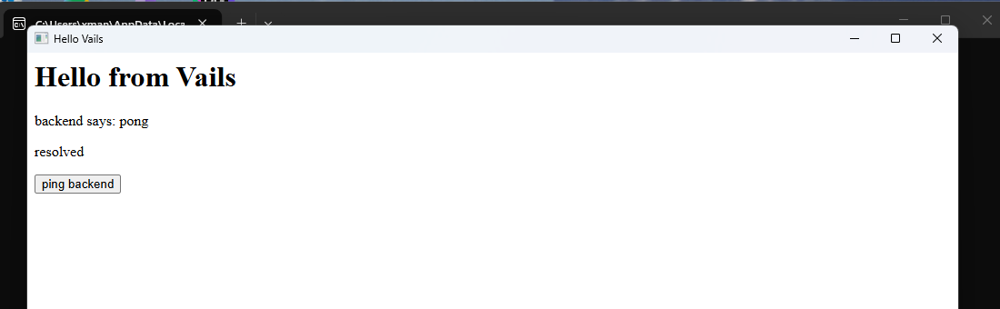
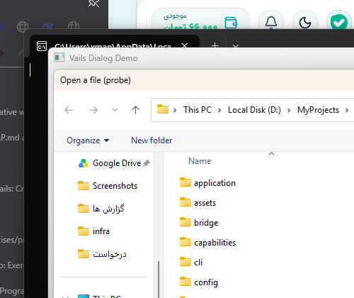
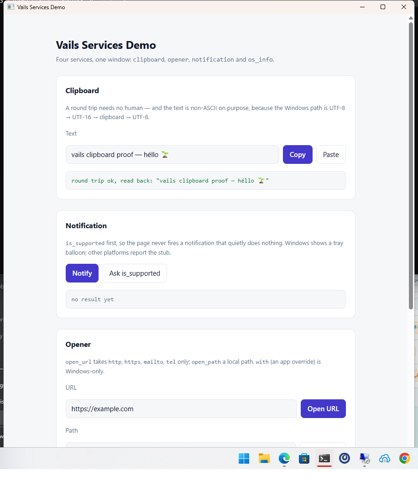
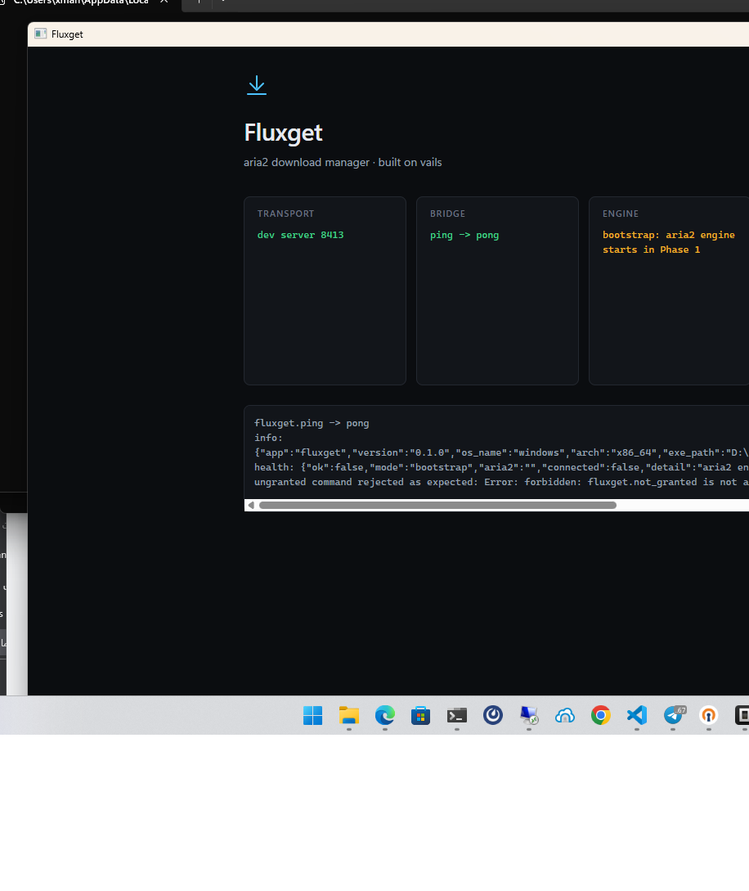
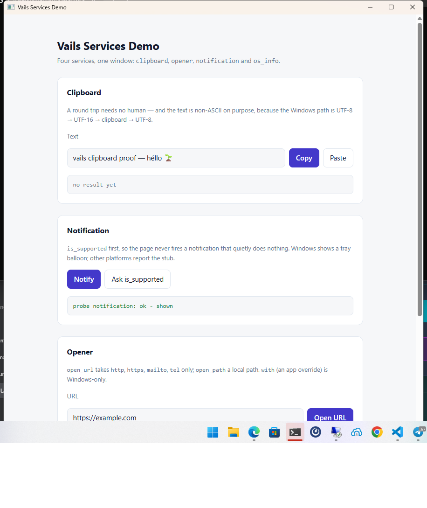

# Windows E2E (manual, needs MSYS2 ucrt64 + Edge WebView2 runtime)

```sh
$env:PATH = "C:\msys64\ucrt64\bin;" + $env:PATH
v -cc gcc -o hello.exe ./examples/hello
# copy next to hello.exe: libwebview-0.12.dll, WebView2Loader.dll,
# libgcc_s_seh-1.dll, libstdc++-6.dll, libwinpthread-1.dll (from ucrt64/bin)
./hello.exe
# click "ping backend" -> status becomes "backend says: pong"
```

Verified 2026-09-26: full JS→V→JS round trip (`window.vails.call('ping')`
→ `bind_cb` → `Router.handle_message` → `ping_handler` → `webview_return`
→ promise resolves). Proof:



## T3 channels / T7 CSP (pure-V, verified via `v test .`)

- Channels (ADR-0011): eval-only — evaluate a `Channel.push_js` snippet
  through the backend and confirm `onEvent('ch_<n>')` fires in order,
  then the `<id>:close` marker after `close_js`.
- CSP (ADR-0012): hello ships `webview.default_csp()` verbatim; confirm
  no CSP violations in DevTools on load.

## Phase 3/4 — dev server + CLI (verified 2026-09-27, ADR-0013)

```sh
$env:PATH = "C:\msys64\ucrt64\bin;" + $env:PATH
# CLI itself imports net (dev server): gcc 16 needs these two flags
v -cc gcc -cflags '-Wno-incompatible-pointer-types' -ldflags '-lws2_32' -o vails.exe ./cli
# copy next to vails.exe: libwebview-0.12.dll, WebView2Loader.dll,
# libgcc_s_seh-1.dll, libstdc++-6.dll, libwinpthread-1.dll (from ucrt64/bin)
./vails.exe init smokeapp; cd smokeapp
../vails.exe doctor   # expect: vails home ok, vails.json ok, asset_root ok
../vails.exe run --serve-only --port 8421
# open http://127.0.0.1:8421/ -> scaffold page with ping button;
# edit frontend/index.html -> page reloads itself (livereload poller)
# /__vails_dev_version returns build_id:tree-fingerprint; /nope -> 404
$env:VAILS_HOME = "D:\MyProjects\vails"   # so build finds the vails root
../vails.exe build    # expect: smokeapp.exe (plain `v -cc gcc`, no extra flags)
```

Notes: `vails run` (window mode) carries an EMPTY router — JS→V calls
fail with `unknown method` until the real app binary runs. Scaffolded
projects outside a checkout need `VAILS_HOME` (or the CLI next to
source) or `build` fails fast telling you so.

## Phase 5 S1 wave 1 — services: `dialog` + `os_info` (ADR-0014, 2026-09-27)

```powershell
$env:PATH = "C:\msys64\ucrt64\bin;" + $env:PATH
v -cc gcc -o dialog.exe ./examples/dialog   # same 5 DLLs next to the exe
./dialog.exe
```

Verified in this run (Windows 11 + MSYS2 gcc 16.1 + V 0.5.2 + WebView2
runtime):

- The page renders (E0 conventions, `prefers-color-scheme`, `focus-visible`)
  and the preview fallback disables every button outside a Vails window.
- `dialog.open` opens the **Common Item Dialog** parented to the webview
  window, with the title from the params and the filters built in pure V
  and parsed in C (`Text (*.txt;*.md)`). Proof:

  

- The proof is driven by the documented example hook, because a synthetic
  mouse click does not reach WebView2 content (two attempts, no event):

  ```powershell
  $env:VAILS_DIALOG_PROBE = "open"   # or: multi | save | message | host
  ./dialog.exe
  # the page calls that command on load; the picker blocks until answered
  ```

- Manual checks still to do by hand (they need a human answer):
  - `Open several…` → multi-select → the `<ul class="paths">` lists every
    path (one `IShellItem` per entry, `IShellItem::GetDisplayName`).
  - `Save as…` → type a name → `ready to write: <path>`.
  - `Ask…` / `Confirm…` → MessageBox with OK / Yes-No-Cancel; the status
    shows `button: ok|yes|no|cancel`.
  - `Read host info` → os/arch/hostname/cwd/cpus from the `os_info` service.
  - `Call an ungranted command` → rejected with `forbidden: app.not_granted
    is not allowed for window "main"` (never `unknown method`).
  - Cancel every dialog once: the result is `{canceled: true}` and the
    promise **resolves** (ADR-0014).
- `vails dts --config examples/dialog/vails.json --js` regenerates
  `examples/dialog/frontend/vails.d.ts` (committed) and the per-service JS
  snippet; `vails doctor` lists the granted services.
- `v test .` is green (29 files) and never opens a window or a dialog —
  modal services are the ADR-0014 exception and are only exercised through
  a fake backend in the tests.

## Phase 5 S1 wave 2 — services: `clipboard` + `opener` + `notification` (ADR-0015, 2026-09-27)

```powershell
$env:PATH = "C:\msys64\ucrt64\bin;" + $env:PATH
v -cc gcc -o services.exe ./examples/services   # same 5 DLLs next to the exe
$env:VAILS_SERVICES_PROBE = "clipboard"         # or: opener | notification | none
./services.exe
```

Verified in this run (Windows 11 + MSYS2 gcc 16.1 + V 0.5.2 + WebView2
runtime), screenshots taken with `capture.ps1` in this directory:

- The **clipboard round trip needs no human**: the page writes
  `vails clipboard proof — héllo 🌱` (non-ASCII on purpose: the Windows path
  is UTF-8 → UTF-16 → clipboard → UTF-8) and reads it straight back, so the
  status line *is* the proof. `VAILS_SERVICES_PROBE=clipboard`:

  

- **`opener`**: `open_url` on `https://vails.invalid/probe` →
  `probe opener: ok - the OS accepted the URL` (ShellExecuteW returned > 32).
  `open_url` with `file:///C:/Windows/win.ini` answers
  `bad params: scheme "file" is not allowed (http, https, mailto, tel)`
  before the OS sees anything. Proof: 

- **`notification`**: `is_supported` → `true`, then the tray balloon is
  queued with the shell and a V worker removes the icon after the clamped
  timeout. Proof: 
  - **Honest caveat**: the balloon itself does not appear in the screenshot.
    Windows 11 routes legacy tray balloons to the Action Center (and can have
    them disabled per app), so the machine-checkable evidence is the status
    line plus `is_supported: true`; whether a balloon is *visible* is a
    per-session setting, not something the service controls.
  - Manual check by eye: run without a probe, press **Notify**, and confirm a
    toast/balloon appears near the tray within ~8 s, and that no icon is left
    behind afterwards (that is the lifetime worker; if one lingers, the
    `spawn` in `notification_windows.c.v` is the thing to look at).
- `Copy` / `Paste` by hand: put something in the clipboard from Notepad, press
  **Paste** — the text shows up; press **Copy**, then paste into Notepad.
- **Try it anyway** (the `file://` URL) → `bad params: …`, shown in green,
  because that rejection is the feature.
- **Ask is_supported** → `is_supported: true` on Windows.
- **Call an ungranted command** → `forbidden: app.not_granted is not allowed
  for window "main"`.

### Taking the screenshots

`capture.ps1` raises the target window (retrying, because a busy desktop
races `SetForegroundWindow`) and then captures its rect — a shot of a covered
window proves nothing:

```powershell
.\capture.ps1 -Out services.png -WindowTitle "Vails Services Demo"
.\capture.ps1 -Out full.png     # whole screen (what a tray balloon needs)
```
